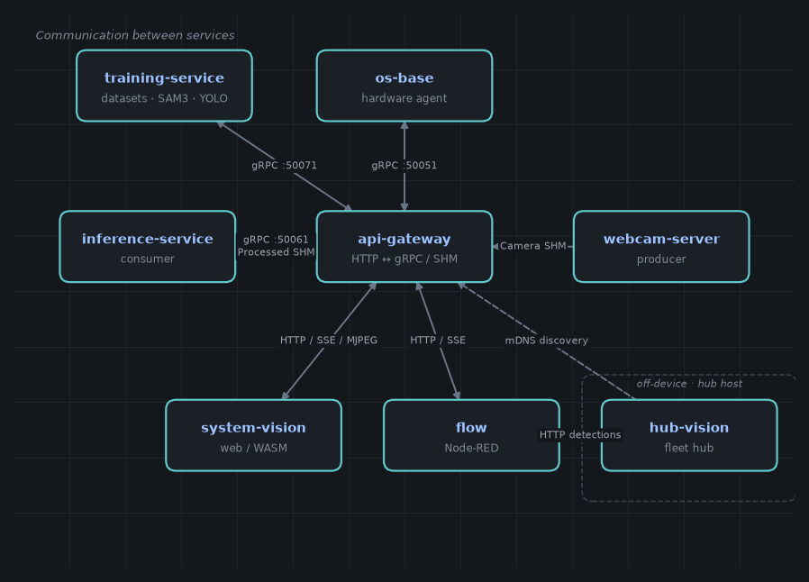

# Conecsa Object Detection System

Real-time object detection system built with a Rust web frontend (Leptos/WASM),
a Rust camera server and a Python inference backend. Designed for the **NVIDIA
Jetson Orin Nano** embedded hardware (ARM64, JetPack 6.2.2 / L4T R36.5.0,
CUDA 12.6), with
**TensorRT-only** inference. A separate native **`hub-vision`** desktop app is the
single authenticated, secure entry point to a fleet: it logs operators in,
discovers devices over mDNS, and reaches each one **only over mutual TLS**,
pulling their detections (off-device, not in the compose stack).

The backend follows an **`app → api → service`** split: a thin **api-gateway**
owns the entire external HTTP/SSE/MJPEG contract, while the heavy work runs in
independent services it reaches over **gRPC** (control/config) or **POSIX shared
memory** (per-frame media). The **inference-service is headless** (no HTTP — only
a gRPC control server + the decode∥infer∥encode pipeline), a privileged
**`os-base` hardware agent** owns host network/Wi-Fi/GPIO over gRPC, and a headless
**training-service** owns datasets, SAM3-assisted labeling and YOLO training.



## Features

- **Real-time detection**: YOLO26 models via TensorRT (`.pt`, `.engine`,
  `.plan`, `.onnx`)
- **Detection areas**: rectangular/circular regions restricting inference
  (normalized coordinates, persistent across restarts)
- **Streaming via shared memory**: zero-copy camera → inference frame transfer
- **MJPEG streaming**: processed stream with detection overlays over HTTP
- **Model management**: upload, selection, deletion and async `.pt → .engine`
  conversion
- **On-device training**: capture datasets, label with SAM3 assistance, train
  YOLO models without leaving the device
- **Camera configuration**: live index/resolution/framerate/exposure changes,
  no restart
- **System monitoring**: real-time CPU, RAM, disk, temperature and GPU usage
- **Web frontend**: Leptos compiled to WASM, served by Nginx
- **Multilingual UI**: English (default), Brazilian Portuguese and Spanish in
  both frontends (`leptos_i18n`, compile-time catalogs under `i18n/`). The
  language is chosen in the hub's **Settings** and propagates to embedded
  device pages via `?lang=` (persisted in the device UI's localStorage)
- **Fleet hub & security gateway**: a separate native (Tauri) `hub-vision` app is
  the single authenticated entry point — it logs operators in, discovers devices
  over mDNS, and reaches each device only over **mutual TLS**, pulling their
  detections (off-device; built with `scripts/build-hub.sh`)
- **No detection is lost while the hub is offline**: each device buffers
  detection records on disk (SQLite ring, survives reboots) whenever the hub
  stops polling, and the hub drains the backlog on reconnect — deleting the
  device copy only after its own store confirms the write, with timestamps
  reconstructed to the real detection time
- **Secure by default**: the device exposes only a `:443` **mTLS** endpoint; the
  hub acts as a private CA, enrolls devices by a one-click pairing, and is the
  sole client holding a valid certificate — no root certificate is ever installed

## Quick start

**On the Jetson (production):**

```bash
# Build and bring everything up in one go.
docker compose up -d --build
docker compose logs -f
```

The production stack publishes **only `:443` (mTLS)** — the device's UI, REST/
MJPEG/SSE API and Flow editor are reachable solely through the `hub-vision` app
([Fleet hub](docs/services/hub-vision.md)). On first run, pair the device from
the hub (one click on the trusted LAN); mTLS then locks it to that hub.

**On an x86_64 workstation with an NVIDIA GPU (local dev):** the root
`docker-compose.yml` is Jetson-specific (aarch64 wheels, Tegra host-library
bind-mounts, GPIO). Use the dev stack, which mirrors production and substitutes
only the Jetson-exclusive parts (x86 `tensorrt-cu12`/`pycuda`, x86 Tailwind).
Requires the [NVIDIA Container Toolkit](docs/getting-started.md#prerequisite-nvidia-container-toolkit):

```bash
docker compose -f docker-compose.dev.yml up -d --build
```

After startup the dev stack keeps the plaintext ports open for convenience: web
app on `http://localhost:80`, api-gateway on `http://localhost:5000`, Flow on
`http://localhost:1880` — plus the `:443` mTLS terminator for testing enrollment
and the hub.

A non-container path is also available — `./scripts/init.sh` bootstraps a local
`.venv` and `./scripts/dev.sh` runs the services on the host (see
[docs/getting-started.md](docs/getting-started.md)).

## Documentation

Full documentation lives under [`docs/`](docs/index.md) and is published as a
[MkDocs](https://www.mkdocs.org/) site (`scripts/build-docs.sh`).

| Topic | Page |
|---|---|
| Architecture & transports | [docs/architecture.md](docs/architecture.md) |
| Prerequisites & local dev | [docs/getting-started.md](docs/getting-started.md) |
| Environment variables | [docs/configuration.md](docs/configuration.md) |
| HTTP API reference | [docs/api-reference.md](docs/api-reference.md) |
| Troubleshooting | [docs/troubleshooting.md](docs/troubleshooting.md) |
| inference-service | [docs/services/inference-service.md](docs/services/inference-service.md) |
| api-gateway | [docs/services/api-gateway.md](docs/services/api-gateway.md) |
| webcam-server | [docs/services/webcam-server.md](docs/services/webcam-server.md) |
| os hardware agent | [docs/services/os-hardware-agent.md](docs/services/os-hardware-agent.md) |
| training-service | [docs/services/training-service.md](docs/services/training-service.md) |
| Flow nodes | [docs/services/flow.md](docs/services/flow.md) |
| Fleet hub (hub-vision) | [docs/services/hub-vision.md](docs/services/hub-vision.md) |
| Protocol Buffers | [`proto/`](proto/) (rendered reference generated into the docs site at build time) |
| Yocto host image | [docs/yocto-build.md](docs/yocto-build.md) |

### Building the docs locally

```bash
pip install -r docs/requirements-docs.txt
mkdocs serve -f docs/mkdocs.yml   # live preview at http://127.0.0.1:8000
# or the full site (MkDocs + cargo doc) into ./site:
scripts/build-docs.sh
```

## Project structure

```
conecsa-object-detection/
├── proto/                  # Protocol Buffers (single source): detection, shm,
│                           #   inference, hardware, training
├── i18n/                   # Shared translation catalogs (en/pt-BR/es) for
│                           #   system-vision + hub-vision (see i18n/README.md)
├── os-base/                     # Base CUDA/ML image + privileged hardware agent + SHM helpers
├── system-vision/          # Rust web frontend (Leptos WASM, served by Nginx)
├── webcam-server/          # Camera server (Rust) — camera SHM producer
├── api-gateway/            # Public HTTP↔gRPC/SHM interface (Python, no ML stack)
├── inference-service/      # Headless TensorRT inference backend (Python)
├── training-service/       # Headless dataset/labeling/training backend (Python)
├── flow/                   # Flow automation (Node-RED) + Conecsa custom nodes
├── hub-vision/             # Native Tauri fleet hub + security gateway (auth, CA,
│                           #   mDNS, mTLS pull); built via scripts/build-hub.sh,
│                           #   NOT in Docker
├── scripts/                # init.sh, dev.sh, compile-proto.sh, build.sh,
│                           #   build-hub.sh, build-hub-jetson.sh,
│                           #   build-docs.sh, gen-proto-docs.py
├── docs/                   # Documentation site (MkDocs config + pages)
├── yocto/                  # Lean Yocto host image for the Jetson
├── requirements-dev.txt    # Single dev venv (all services + docs toolchain)
├── pyrightconfig.json      # Pyright/Pylance: type checking (editor + CI)
├── docker-compose.yml      # Production stack (Jetson)
└── docker-compose.dev.yml  # Local dev stack (x86_64 + NVIDIA GPU)
```

> Each service builds from its own `Dockerfile.<service>`; the dev stack reuses
> them and only swaps `os-base/Dockerfile.os-base.dev` (x86 GPU wheels) and
> `system-vision/Dockerfile.system-vision.dev` (x86 Tailwind).

> **Dev environment & type-checking:** run `./scripts/init.sh` (creates the root
> `.venv`, installs `requirements-dev.txt`, and compiles the proto stubs so the
> editor resolves the generated modules). See
> [docs/getting-started.md](docs/getting-started.md) for details.

## License

See repository metadata.
